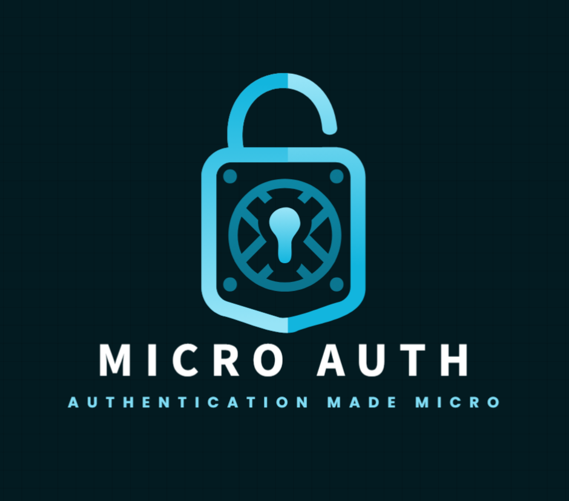

<div align="center">
  
  <br>
  <a href="https://github.com/rahulc0dy/micro-auth/releases">
    
  </a>
  <a href="https://github.com/rahulc0dy/micro-auth/issues">
    
  </a>
  <a href="https://github.com/rahulc0dy/micro-auth">
    
  </a>
</div>

# Authentication Microservice

A robust authentication microservice built with [Deno](https://deno.land/) and [Hono.js](https://hono.dev/). This
microservice provides essential authentication features, including support for **JWT**, **OAuth**, *
*email/phone-password login**, and **two-factor authentication (2FA)**.

---

[](https://github.com/rahulc0dy/micro-auth/actions/workflows/run-tests.yml)
[](https://github.com/rahulc0dy/micro-auth/actions/workflows/builds.yml)


---

## 🚀 Features

- **🔒 JWT (JSON Web Tokens)**: Secure token-based authentication for stateless session management.
- **🌐 OAuth**: Simplified third-party authentication using providers like Google, Facebook, and GitHub.
- **📧 Email/Phone and Password Login**: Classic user authentication with support for email or phone as identifiers.
- **🛡️ Two-Factor Authentication (2FA)**: Enhanced security through OTP-based two-factor authentication.

---

## 📋 Table of Contents

- [Prerequisites](#-prerequisites)
- [Setup](#-setup)
- [Environment Variables](#-environment-variables)
- [API Endpoints](#-api-endpoints)
- [Usage](#-usage)
- [Technologies Used](#-technologies-used)
- [License](#-license)

---

## ✅ Prerequisites

- [Deno](https://deno.land/) (v2.0 or higher)
- [Git](https://git-scm.com/) (v2.0 or higher)

---

## ⚙️ Setup

1. **Clone the repository:**
   ```bash
   git clone https://github.com/rahulc0dy/micro-auth.git
   cd micro-auth
   ```

2. **Setup environment variables:**

   Set up your environment variables as shown in the [_Environment Variables_](#️-environment-variables)
   section.<br><br>

3. **Install dependencies:**
   ```bash
   deno task deps
   ```

4. **Run the application in dev mode:**
   ```bash
   deno task dev
   ```

---

## 🛠️ Environment Variables

Create a `.env` file in the root of your project with variables specified in the `.env.example` file.

---

## 🌐 API Endpoints

### Authentication

#### **POST** `/auth/register`

- **Description**: Register a new user with email/phone and password.
- **Request Body:**
  ```json
  {
    "email": "user@example.com",
    "password": "securepassword"
  }
  ```

#### **POST** `/auth/login`

- **Description**: Login with email/phone and password.
- **Request Body:**
  ```json
  {
    "email": "user@example.com",
    "password": "securepassword"
  }
  ```

#### **POST** `/auth/refresh`

- **Description**: Refresh the JWT token.

#### **POST** `/auth/logout`

- **Description**: Logout and invalidate the current session.

### OAuth

#### **GET** `/oauth/:provider`

- **Description**: Redirect to the OAuth provider's login page (e.g., Google).

#### **GET** `/oauth/callback`

- **Description**: Handle the OAuth callback and issue a JWT token.

### 2FA

#### **POST** `/auth/2fa/setup`

- **Description**: Generate a 2FA QR code for the user.

#### **POST** `/auth/2fa/verify`

- **Description**: Verify the OTP code for 2FA.
- **Request Body:**
  ```json
  {
    "otp": "123456"
  }
  ```

---

## 📌 Usage

### Register a New User

```bash
curl -X POST http://localhost:<PORT>/auth/register \
-H "Content-Type: application/json" \
-d '{ "email": "user@example.com", "password": "securepassword" }'
```

### Login

```bash
curl -X POST http://localhost:<PORT>/auth/login \
-H "Content-Type: application/json" \
-d '{ "email": "user@example.com", "password": "securepassword" }'
```

### Set Up 2FA

```bash
curl -X POST http://localhost:<PORT>/auth/2fa/setup \
-H "Authorization: Bearer <JWT_TOKEN>"
```

### Verify 2FA Code

```bash
curl -X POST http://localhost:<PORT>/auth/2fa/verify \
-H "Authorization: Bearer <JWT_TOKEN>" \
-d '{ "otp": "123456" }'
```

---

## 🛠️ Technologies Used

- **Deno**: A modern runtime for JavaScript and TypeScript.
- **Hono.js**: Lightweight and fast web framework.
- **JWT**: Secure token management.
- **OAuth**: Simplified third-party authentication.
- **Two-Factor Authentication**: Enhanced security for user accounts.

---

## 📜 License

This project is licensed under the MIT License. See the [LICENSE](LICENSE) file for details.

## Contributing

We welcome contributions to make Authentication Microservice better for everyone.
Please review our [Contributing Guidelines](https://github.com/rahulc0dy/micro-auth/blob/master/docs/CONTRIBUTING.md) to
get started.
